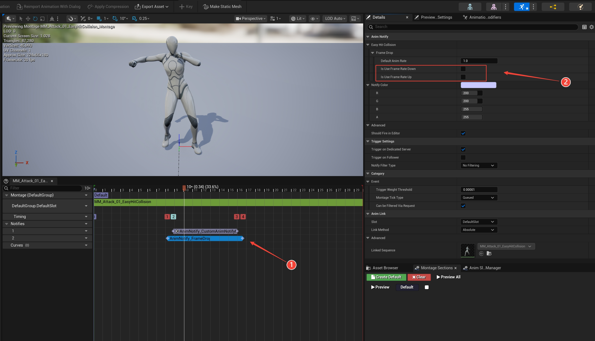

# Easy Hit Collision Plugin

## 1. After downloading the plugin from the Fab Marketplace, search for "Easy Hit Collision System" in the UE Plugins panel, enable it, then search for State Tree and enable the built-in UE State Tree plugin. Restart UE.

## 2. Follow the numbered order in the image to set up! -- Add Custom Collision Channel
    1. Click Collision in Project Settings
    2. Add a new Trace Channel, set to Ignore by default.

## 3. Add sockets to the weapon -- Static Mesh or Skeletal Mesh are both supported.
    1. Right-click the root tree and add sockets. Add at least 2 sockets.
    **You can add multiple segments of sockets to the weapon. If the weapon is not highly curved, it is recommended to add only two sockets.
    **The Easy Hit Collision component added to the character supports multiple segments, so there is no need to add an excessive number of sockets here.

## 4. Follow the numbered order in the image to set up! -- Component Function Setup
    1. In your character blueprint, click Add Component, search for Easy Hit Collision
    2. Select the Easy Hit Collision component
    3. Choose the custom Trace Channel you created above
    4. Select detection mode: Line Mode or Combined Mode
    5. Enter the socket names you added to the weapon earlier, in the **exact same order** as on the weapon.
    Other settings can remain default, or you can explore them on your own.
    **Note: This plugin was originally developed for my own project. Since my game does not support dual weapons, I reserved interfaces for dual-weapon functionality but did not implement it. Therefore, you can only select Single Weapon for the weapon type at this time.

## 5. Follow the numbered order in the image to set up! -- State Tree Setup
    1. In your character blueprint, click Add Component, search for State Tree Component (Note: Do NOT select AI State Tree)
    2. Select the State Tree component added to the character
    3. In the State Tree Details panel, click to select the State Tree asset.
    (If StateTree_EasyHitCollision does not appear in the dropdown, perform steps 4 and 5)
    6. Select the State Tree asset: StateTree_EasyHitCollision.

## 6. Follow the numbered order in the image to set up! -- Anim Montage Notify Setup <Required>

    1. In the player character's attack animation montage, select a track, right-click and choose Montage State Notify, then find AnimNotify_HitCollision.
    Adjust the positions where collision detection starts and ends.
    You can set a name for the animation notify; the Easy Hit Collision component will return the notify name, allowing you to implement different logic for different animations.

## 7. Follow the numbered order in the image to set up! -- Anim Montage Notify Setup <Optional Extra>

    1. This is an additional frame freeze feature included in the plugin. Simply add the animation state notify: AnimNotify_FrameDrop.
    2. In the Details panel, check your desired mode.
    **Mode 1** -- Frame Rate Down: On Hit → Slow Down → Duration → Return to Default Rate
    **Mode 2** -- Frame Rate Up: On Hit → Pause → Duration → Accelerate to Default Rate

    In-game, you can drag off the Easy Hit Collision component and use one of the following functions to enable or disable this feature:
    PrimaryManualSetFrameDrop – enables or disables both modes simultaneously.
    PrimaryManualSetFrameDropDown – enables or disables Mode 1.
    PrimaryManualSetFrameDropUp – enables or disables Mode 2.

## 8. Follow the numbered order in the image to set up! -- Register Weapon Setup
    1. Open the player character blueprint. After Event BeginPlay, drag off the Easy Hit Collision component and find Register Weapon Mesh Component.
    2. Drag from Weapon Skeletal Mesh Comps and create a Make Array node. **Note: You can pass in a Skeletal Mesh or Static Mesh here; the parameter naming has not been corrected.
    3. Connect your weapon component to the input.

## 9. Follow the numbered order in the image to set up! -- Enemy Blueprint Setup
    1. Set the enemy blueprint's collision preset to Custom.
    2. Find the custom Trace Channel you added earlier in Project Settings and set it to Block.

## 10. Open the player character blueprint. -- All setup is complete

    1. Select the Easy Hit Collision component. In the Details panel, you will find collision return events.
    On Trace Started – Executes when the animation notify AnimNotify_HitCollision begins during montage playback, regardless of whether an enemy is hit.
    On Trace Ended – Executes when the animation notify AnimNotify_HitCollision ends during montage playback, regardless of whether an enemy is hit.
    On Unique Hit – Executes only when the first enemy is hit.
    On Hit – Executes for each different enemy hit.

    --- When Trace Hit Mode in the Easy Hit Collision component is set to "Single", On Unique Hit and On Hit behave identically.

