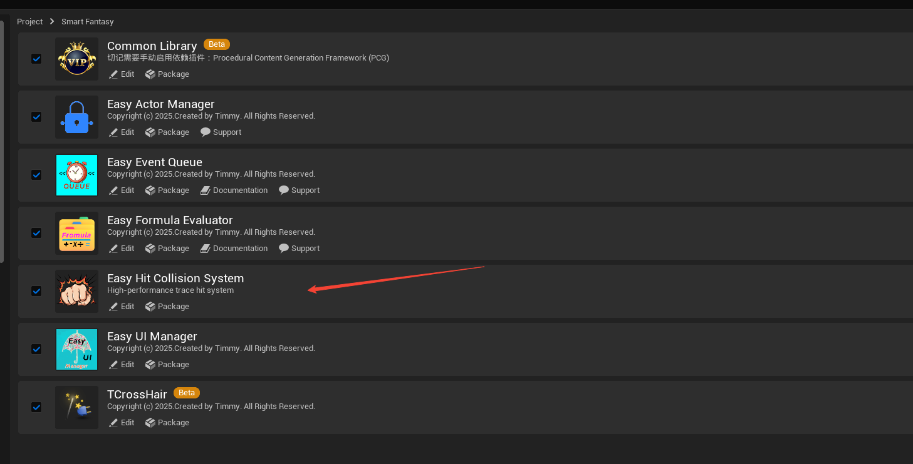
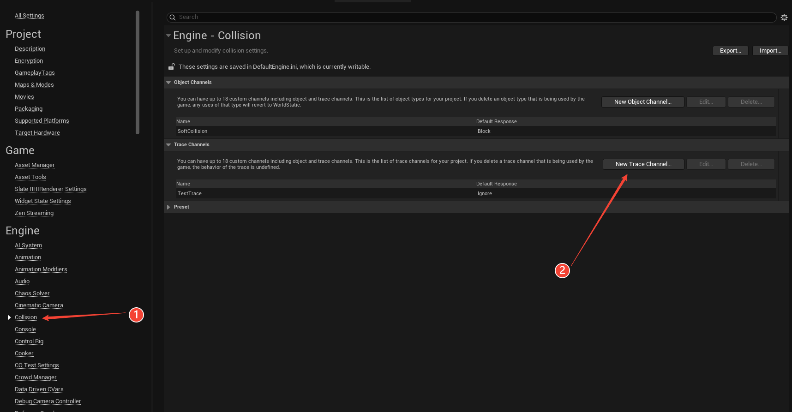
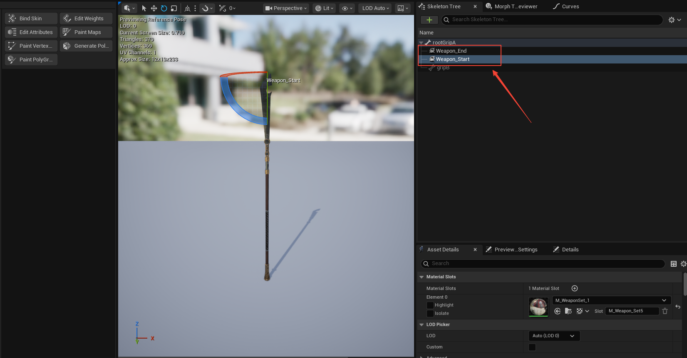
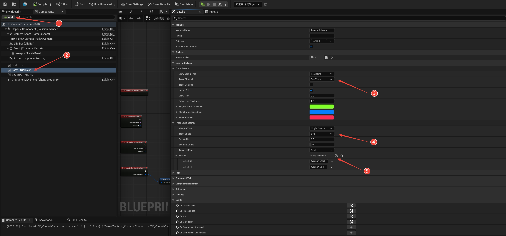
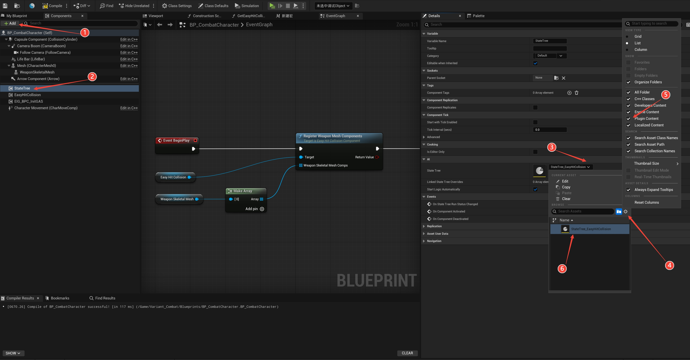
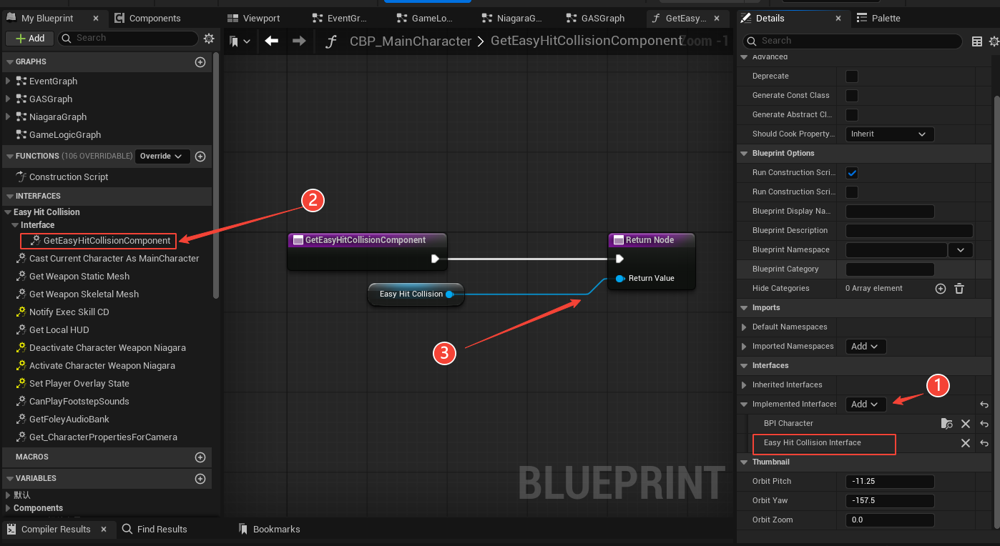
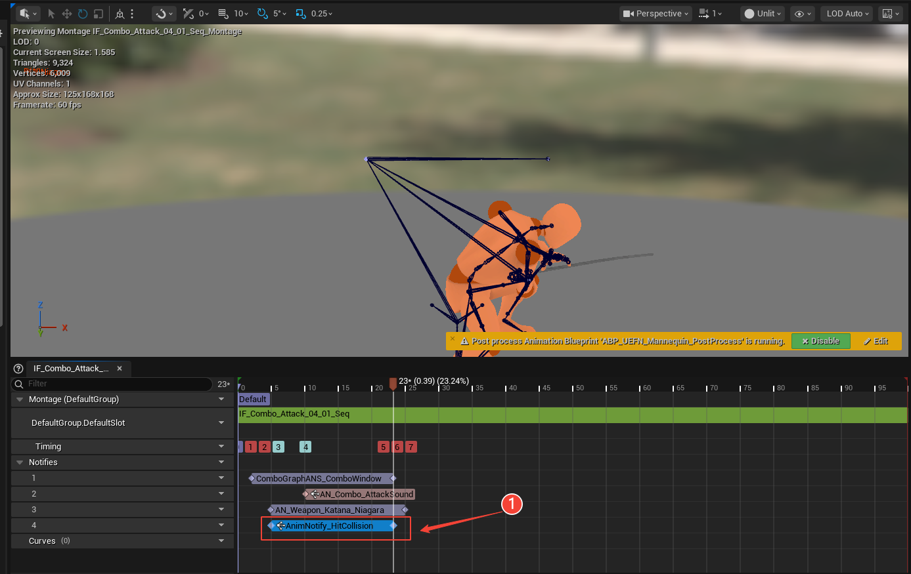
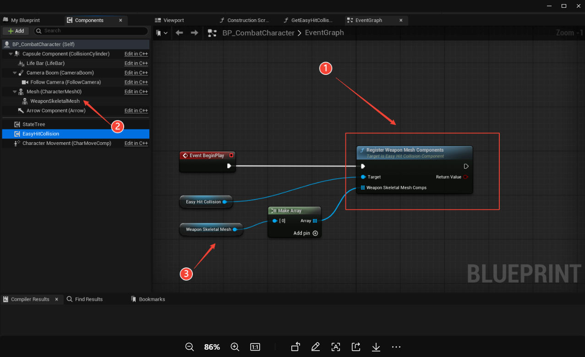
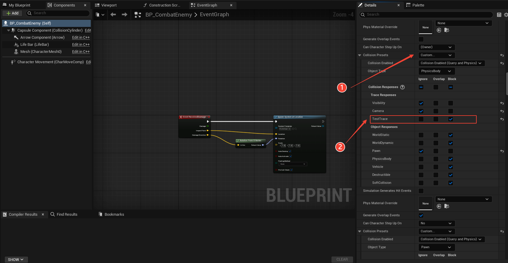
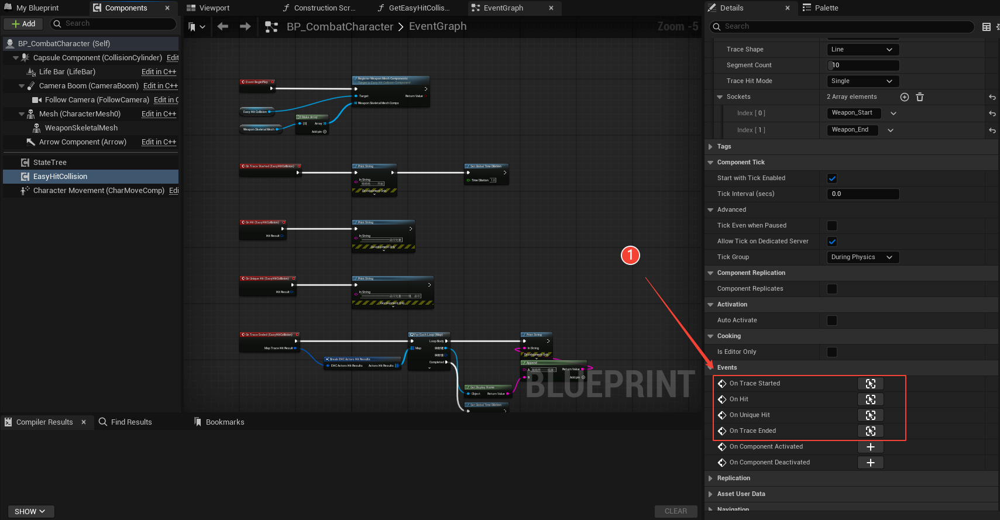

# Easy Hit Collision Plugin

## 1. After downloading the plugin from the Fab Marketplace, search for "Easy Hit Collision System" in the UE Plugins panel and enable it. Then search for State Tree and enable the built-in UE State Tree plugin. Restart Unreal Engine.

## 2. Follow the numbered order in the image to set up! -- Add Custom Collision Channel
    1. Click on Collision in Project Settings.
    2. Add a new Trace Channel, set to Ignore by default.

## 3. Add sockets to the weapon -- Static Mesh or Skeletal Mesh are both supported.
    1. Right-click the root tree and add sockets. Add at least 2 sockets.
    **You can add multiple sockets to the weapon. For weapons that are not highly curved, it is recommended to add only two sockets.
    **The Easy Hit Collision component on the character supports multiple segments, so there is no need to add an excessive number of sockets here.

## 4. Follow the numbered order in the image to set up! -- Component Function Setup
    1. In your character Blueprint, click Add Component, search for Easy Hit Collision.
    2. Select the Easy Hit Collision component.
    3. Choose the custom trace channel you created earlier.
    4. Select detection mode: Line Mode or Combined Mode.
    5. Add the socket names you created on the weapon, in the **exact same order** as on the weapon mesh.
    Other settings can remain default, or you can explore them on your own.
    **Note: This plugin was originally developed for my own project. Since my game does not use dual weapons, I added interface support for dual weapons but did not implement the full functionality. Therefore, you can only select Single Weapon for now.

## 5. Follow the numbered order in the image to set up! -- State Tree Setup
    1. In your character Blueprint, click Add Component, search for State Tree Component (Important: Do NOT select AI State Tree).
    2. Select the State Tree Component added to the character.
    3. In the Details panel of the State Tree, select the State Tree asset.
    (If StateTree_EasyHitCollision does not appear in the dropdown, perform steps 4 and 5.)
    6. Select the StateTree_EasyHitCollision asset.

## 6. Follow the numbered order in the image to set up! -- Player Character Blueprint Interface Setup
    1. In your character Blueprint, go to Class Settings → Details panel, add the Easy Hit Collision Interface.
    2. In My Blueprint of the character, implement the interface functions.
    3. Return the Easy Hit Collision component to the function output.

## 6. Follow the numbered order in the image to set up! -- Animation Montage Notify Setup
    1. In the player character's attack Animation Montage, select a track, right-click and choose Montage State Notify, then select AnimNotify_HitCollision.
    Adjust the positions for collision detection start and end.

## 6. Follow the numbered order in the image to set up! -- Register Weapon Setup
    1. Open the player character Blueprint. After Event Game Begin, drag off the Easy Hit Collision component and find Register Weapon Mesh Component.
    2. Drag from Weapon Skeletal Mesh Comps and create a Make Array node. **Note: You can pass in Skeletal Mesh or Static Mesh here; the parameter naming has not been corrected yet.**
    3. Connect your weapon component to the input.

## 6. Follow the numbered order in the image to set up! -- Enemy Blueprint Setup
    1. Set the enemy Blueprint's collision preset to Custom.
    2. Find the custom trace channel you added in Project Settings and set it to Block.

## 6. Open the player character Blueprint. -- All setup completed
    1. Select the Easy Hit Collision component. In the Details panel, you will find collision-related events.
    On Trace Started -- Executes when the AnimNotify_HitCollision begins during montage playback, regardless of whether an enemy is hit.
    On Trace Ended -- Executes when the AnimNotify_HitCollision ends during montage playback, regardless of whether an enemy is hit.
    On Unique Hit -- Executes only when the first enemy is hit.
    On Hit -- Executes for each different enemy hit.

    --- When Trace Hit Mode in the Easy Hit Collision component is set to "Single", On Unique Hit and On Hit behave identically.

